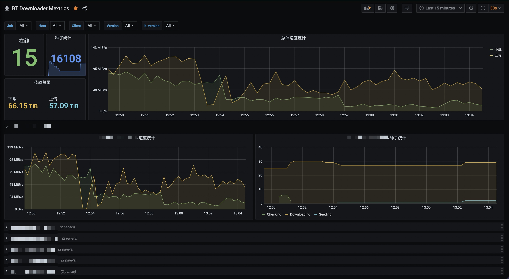

# downloader-exporter

A prometheus exporter for qBitorrent/Transmission/Deluge. Get metrics from multiple servers and offers them in a prometheus format.


## How to use it

You can install this exporter with the following command:

```bash
pip3 install downloader-exporter
```

Then you can run it with

```
downloader-exporter -c CONFIG_FILE_PATH -p 9000
```

Another option is run it in a docker container.

```
docker run -d -v CONFIG_FILE_PATH:/config/config.yml -e EXPORTER_PORT=9000 -p 9000:9000 leishi1313/downloader-exporter
```
Add this to your prometheus.yml
```
  - job_name: "downloader_exporter"
    static_configs:
        - targets: ['yourdownloaderexporter:port']
```

### The exporter is running too slow

You can use an options to expose multiple ports for each downloader you're watching. Then the exporter will open a range of ports starting from the one you set, each port for each downloader

With command line
```
downloader-exporter -c CONFIG_FILE_PATH -p 9000 --multi true
```

With docker
```
docker run -d -v CONFIG_FILE_PATH:/config/config.yml -e EXPORTER_PORT=9000 -e USE_MULTI_PORTS=true -p 9000-9010:9000-9010 leishi1313/downloader-exporter
```

# Config file

The config file is compatible with [autoremove-torrents](https://github.com/jerrymakesjelly/autoremove-torrents), you can also refer to `example.yml` to see how to write it.

# Grafana

You can use the provided `docker-compose.yml` to host your own stack of `Grafana`/`Prometheus`/`downloader-exporter`.

Simplely clone this project, add or edit `config.yml`, then start the docker-compose:

```shell
cp example.yml config.yml
docker-compose up -d
```

Use `localhost:3000` and `admin`/`admin` to access the dashboard.

First you will need to add a data source, select `Prometheus` with URL `prometheus:9090`, Then go and add a new dashboard with ID `15006`, the dashboard should look like

